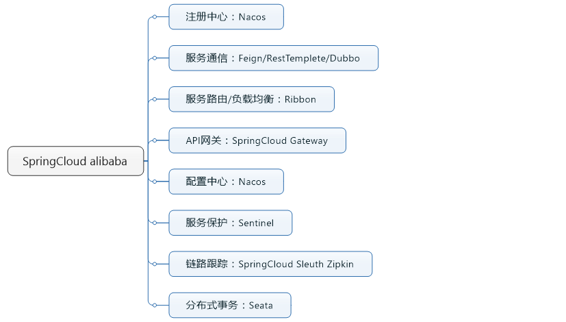

###spring学习路径

项目学习顺序
1、项目：mfq-springframework
----对于容器的基本认知
----IOC/DI/AOP

2、项目：mfq-spring       
----源码解析--容器启动过程)
----bean的生命周期
----容器/三级缓存
----反射/cglib/动态代理

3、项目：mfq-mybatis
----概念：数据库连接池的维护管理
----java如何整合mysql，实现一个数据库连接池

4、项目：mfq-mybatis-spring
----spring如何整合mybatis
----

5、项目：mfq-web-mvc等

一、spring
spring宏观上可以指整个spring生态，但通常单独讲spring时，特指的spring framework;
而spring framework 也是我们学习spring生态的基础
初期SSH：Struts2+Spring+Hibernate
后期SSM：SpringMVC+Spring+Mybatis

1、spring(framework)是一个轻量级编程框架：其中核心设计思想为IOC/DI、AOP
此思想非常优秀，延续而来的springMVC,以及spring整合的各个组件乃至整个生态
可以实现与redis/mybatis/dubbo等组件之间的整合

2、springboot是spring的升级版，是一套快速配置脚手架，可以基于spring boot快速开发单个微服务，核心思想是默认大于配置，并且整合了servlet容器，
原本spring需要依赖tomcat作为父容器启动，而有了springboot之后，可以通过jar包的方式启动一个服务
可以更为便捷的整合各个外部组件redis/mybatis/dubbo，只通过引入包加上较少的配置即可快速实现某特性

3、spring cloud 是基于spring boot实现的云应用开发工具，可以理解为一个生态，生态中提供了大型网络应用场景中各种情况的解决方案
比如配置中心config/网关gateway/注册中心eureka/熔断器hystrix/负载均衡ribbon/远程调用feign等等

4、spring cloud alibaba 提到了spring cloud 就必须要提到spring cloud alibaba
spring cloud其中一些开源项目已停止维护，不再更新例如eureka
而spring cloud alibaba则是是国产的微服务开发一站式解决方案，与原有 Spring Cloud 兼容的同时对微服务生态进行扩展，
通过添加少量的配置注解，便可实现更符合国情的微服务架构，当前Spring Cloud Alibaba已经是直接隶属于 Spring Cloud 的子项目

